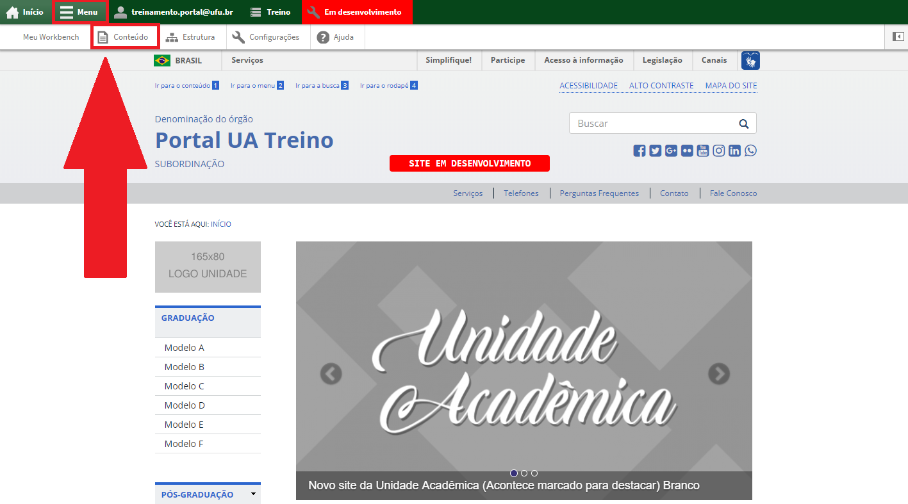
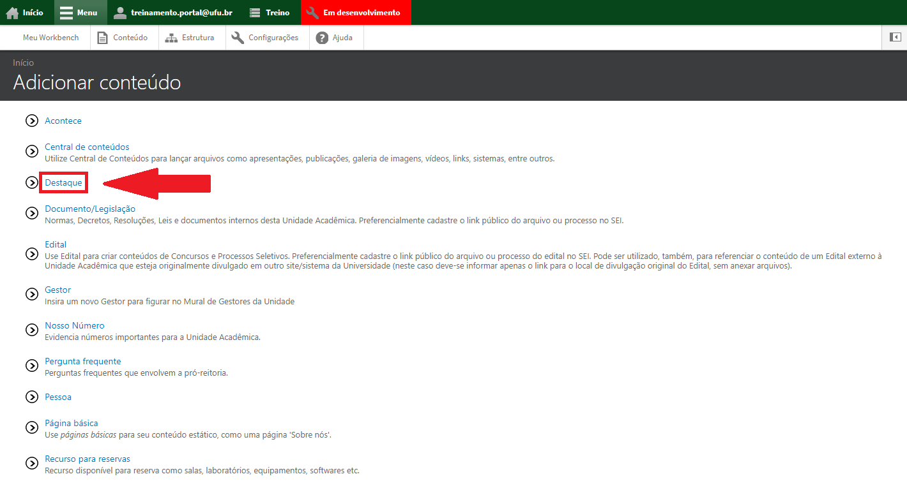
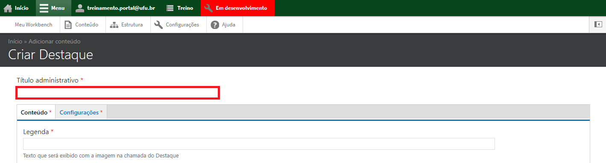
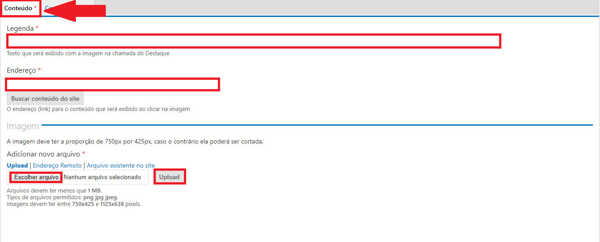
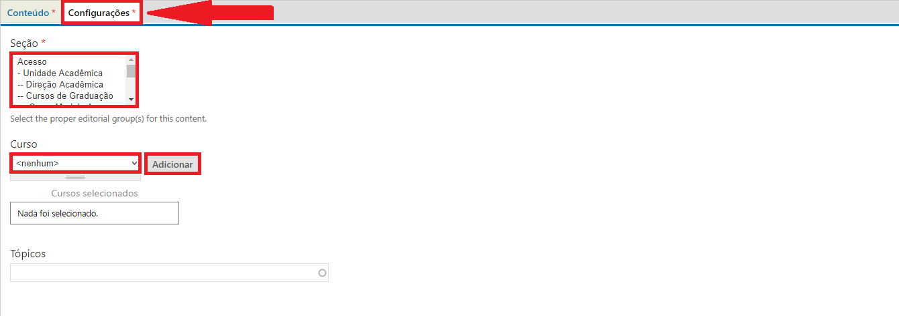

# Adicionar destaque

O tipo de conteúdo Destaque é utilizado para criar uma notícia destacada em forma de banner na página principal da unidade acadêmica ou na página principal de algum curso em específico.

Para cadastrar um tipo de conteúdo Destaque, vá até o menu superior no website, clique em Menu, depois em Conteúdo, conforme a imagem abaixo:

Depois clique em Adicionar Conteúdo, conforme a imagem abaixo:

Escolha o tipo de conteúdo Destaque, conforme a imagem abaixo:

Preencha o título do Destaque no campo Título, conforme a imagem abaixo:

Na aba Conteúdo, no campo Legenda, insira a legenda que irá aparecer na parte inferior da imagem no banner. No campo Endereço, preencha o link da página que será 
aberta ao clicar na notícia, e em Imagem, insira a imagem da notícia clicando em Escolher arquivo, escolha a imagem, depois clique em Upload. Lembrando que a
imagem deve estar no formato 750x425, conforme a imagem abaixo:

Na aba Configurações, escolha a seção a qual a notícia destaque pertence, e caso pertença a algum curso, selecione o tipo do curso, o curso, e em seguida clique
em Adicionar, conforme a imagem abaixo:

Ao final da página, pode ser feito o agendamento da publicação do conteúdo, preencha caso deseje agendar para um momento posterior ou clique em Salvar para
publicar na mesma hora, conforme a imagem abaixo:

Ao final da Página clique em Salvar, conforme a imagem abaixo:

