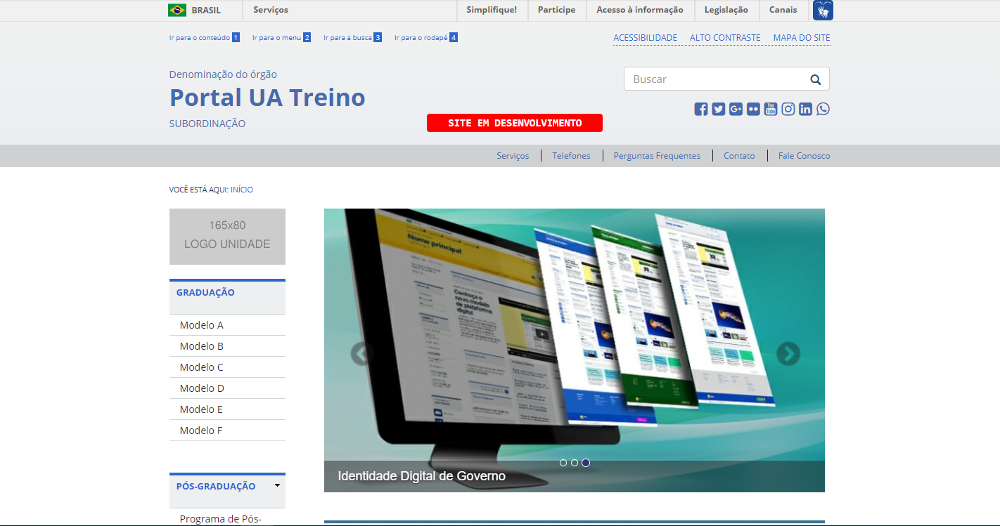
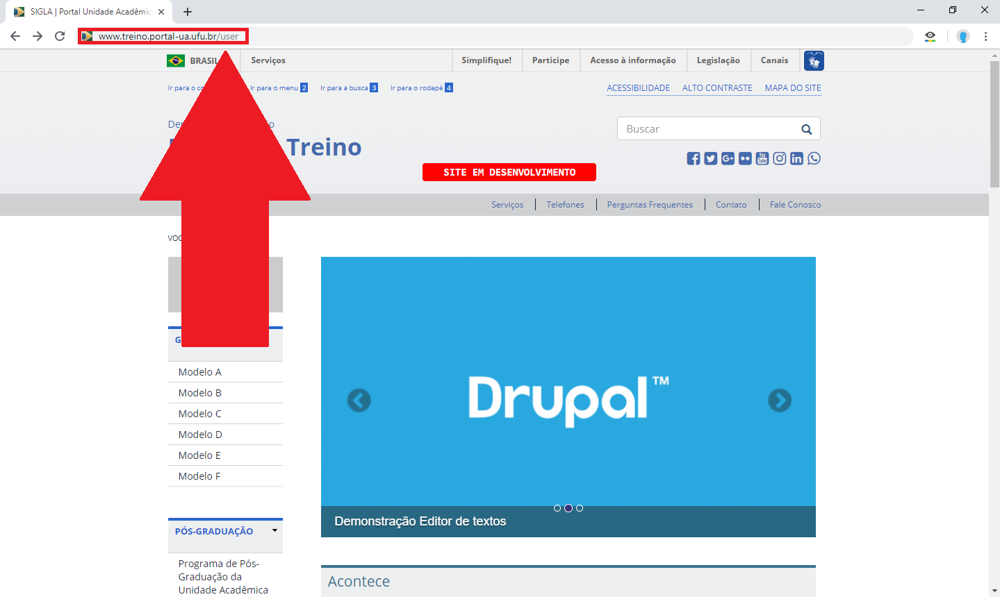
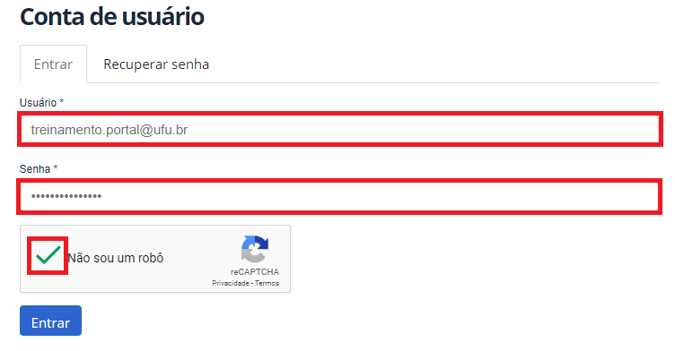
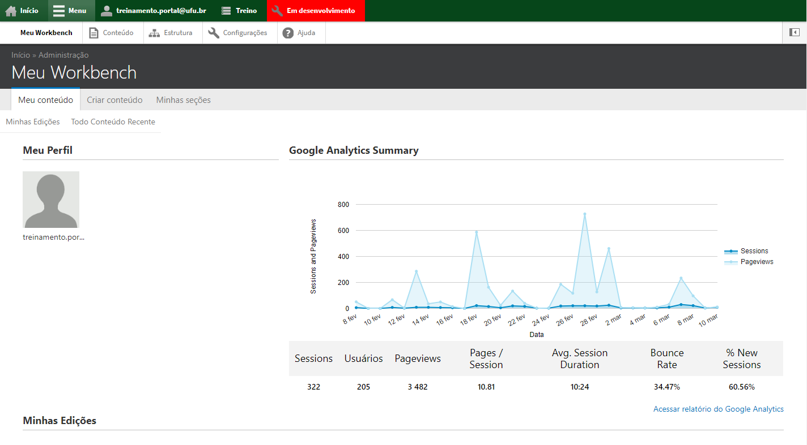
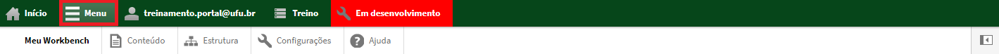
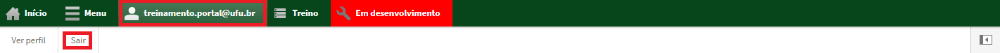

# Acessar e sair da conta

Fazer o login é o processo de acessar sua conta para fazer as devidas alterações no website, e o logout é o processo de sair da sua conta, para que pessoas não autorizadas não a utilizem para alterar dados dos website.

Primeiramente, entre na página inicial do website da sua Unidade Acadêmica, conforme a figura abaixo:

Para fazer o login, digite /user na barra de endereço do website e aperte Enter (Ex: www.ufu.br/user), conforme a figura abaixo:

Para acessar sua conta (login), entre com seu e-mail institucional UFU, e marque a caixa “Não sou um robô”, conforme a figura abaixo:

Após o login você estará em Meu Workbench, que é a página principal do seu ambiente de trabalho, toda vez que fizer o login, ela será apresentada, mostrando suas edições, conteúdos recentes e os dados de análise do website,
conforme a figura abaixo:

Agora você pode fazer edições, publicar e despublicar conteúdos. Para editar conteúdos, navegue no website através da barra superior que aparece após o login, conforme a figura abaixo:

Para sair de sua conta (logout), basta clicar no seu email na barra superior do website e clicar em sair, conforme a figura abaixo:

