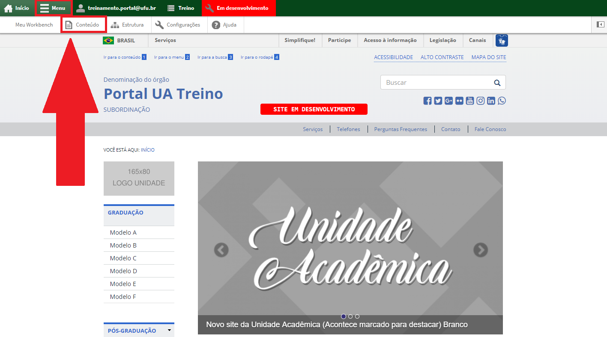
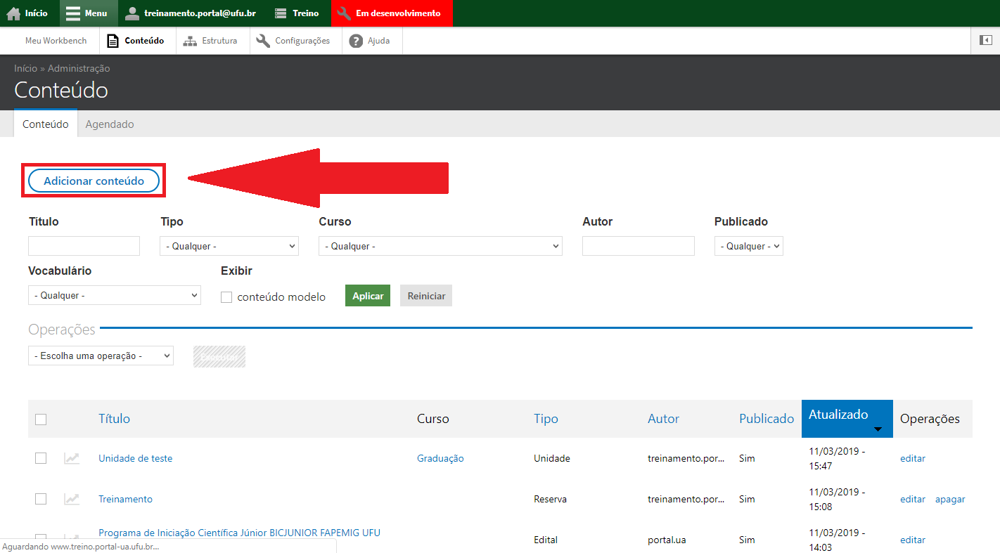
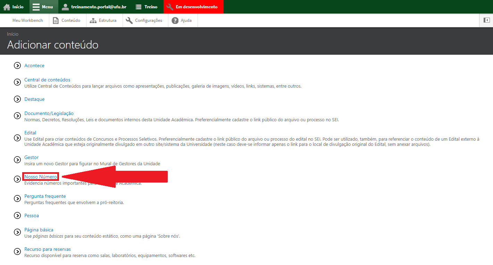
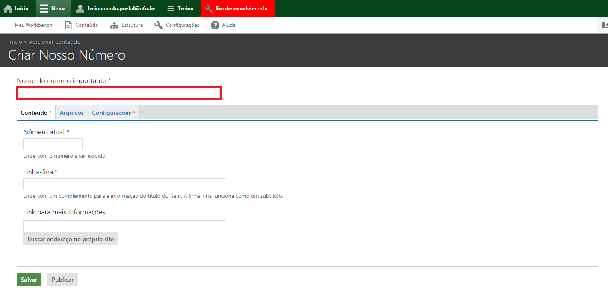
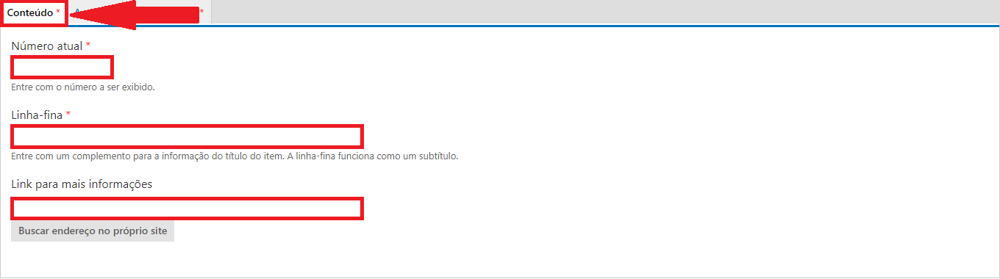
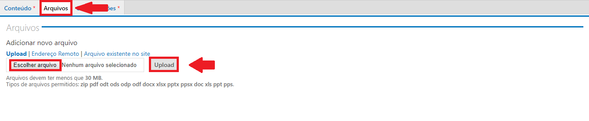
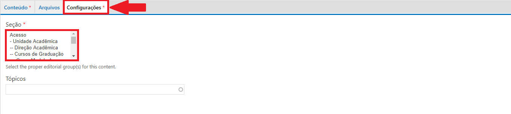

# Adicionar nossos números

Nossos Números é uma seção do site destinada a contagem de alunos, docentes, projetos, dentre outros números que a unidade acadêmica julgue ser importante.

Para cadastrar um tipo de conteúdo Nossos Números, vá até o menu superior no website, clique em Menu, depois em Conteúdo, conforme a figura abaixo:

Depois clique em Adicionar Conteúdo, conforme a figura abaixo:

Escolha o tipo de conteúdo Nossos Números, conforme a figura abaixo:

Preencha o Nome do número importante, conforme a figura abaixo:

Na aba Conteúdo, em Número atual, insira o número a ser exibido. Na linha-fina, insira o complemento para a informação do título do número importante e em Link para
mais informações, insira o link onde estão mais informações sobre o número apresentado, seja uma página, uma reportagem, dentre outros, conforme a figura abaixo:

Na aba Arquivos, caso seja necessário colocar algum arquivo em anexo, clique em escolher arquivo, escolha o arquivo desejado e depois clique em Upload, conforme a figura abaixo:

Na aba Configurações, selecione a Seção a qual o número pertence, conforme a figura abaixo:

Ao final da Página clique em Salvar, conforme a figura abaixo:

