# Adicionar reserva

A funcionalidade Reservas está disponível nos novos portais das Unidades Acadêmicas e tem como objetivo reservar salas, equipamentos ou laboratórios da UFU.

# Instruções para o Solicitante

<video width="320" height="240" controls>
  <source src="../videos/Treinamento Reservas - Solicitante.mp4" type="video/mp4">
  Seu navegador não é compatível.
</video>

Para reservar uma sala, o solicitante deve acessar o website da sua Unidade Acadêmica e clicar em Serviços, no menu horizontal da página (abaixo do nome e
acima da logo da unidade acadêmica), conforme a figura abaixo:

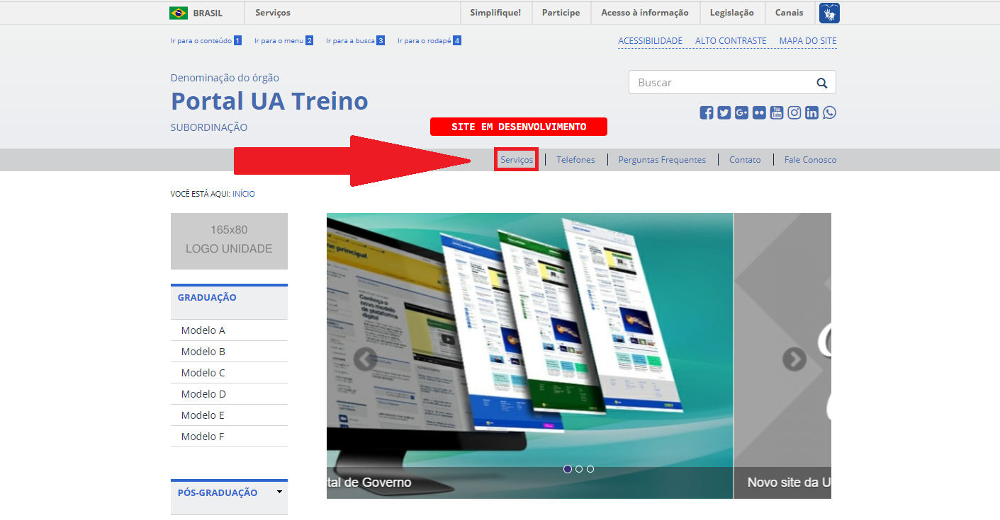

Na lista de serviços, o solicitante deve procurar por Agendamento de Recursos da Unidade Acadêmica, depois clicar em Agendamento de Recursos,  conforme a figura abaixo:

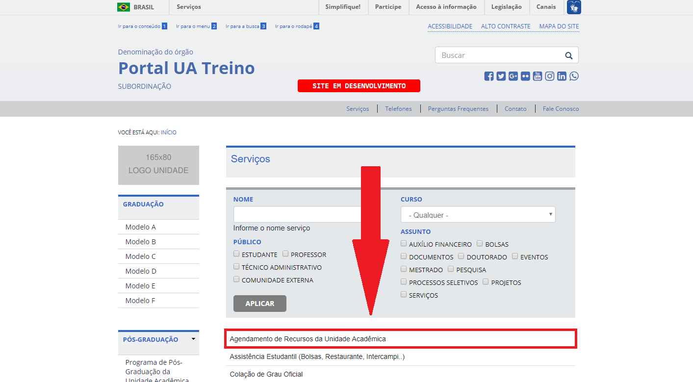

Dentro de Agendamento de Recursos da Unidade Acadêmica, clique em Agendamento de Recursos,  conforme a figura abaixo:

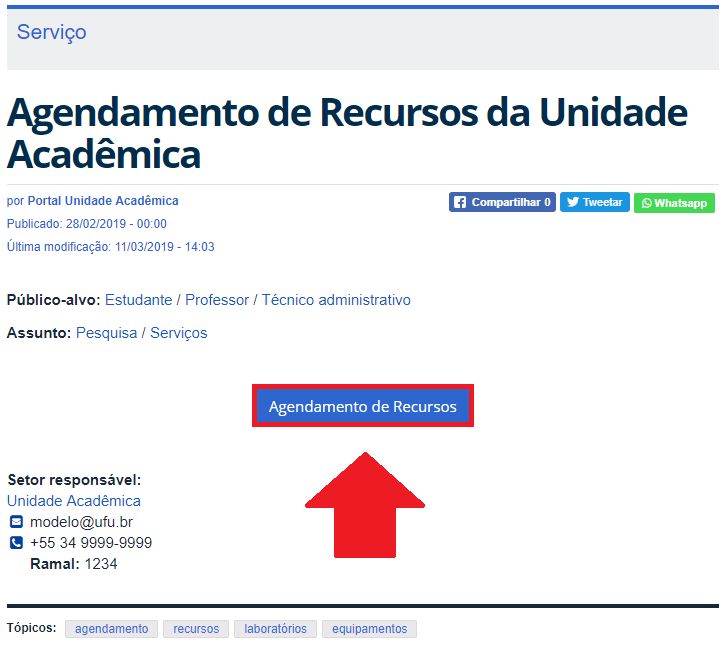

O solicitante deve verificar os horários livres para reserva clicando em Calendário no menu vertical Agendamento,  conforme a figura abaixo:

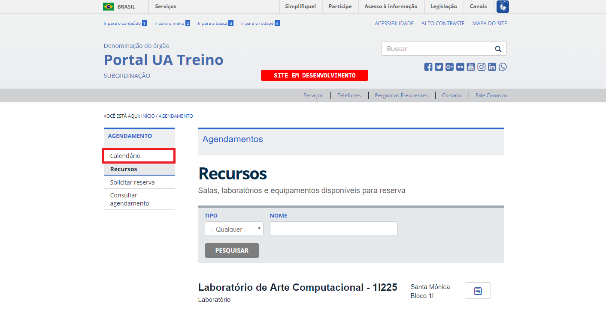

Verifique os horários disponíveis no calendário,  conforme a figura abaixo:

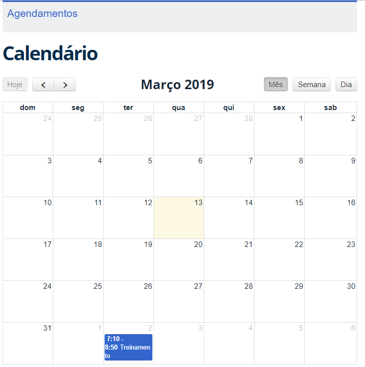

Após verificar os horários livres, o solicitante deverá clicar em Solicitar reserva no menu vertical,  conforme a figura abaixo:

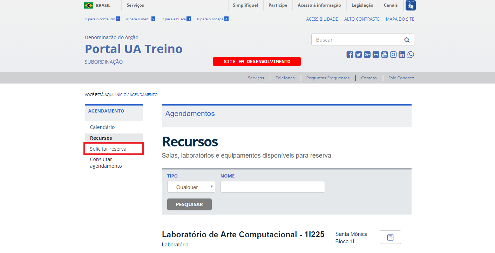

Preencha o formulário de solicitação de reserva,  conforme a figura abaixo:

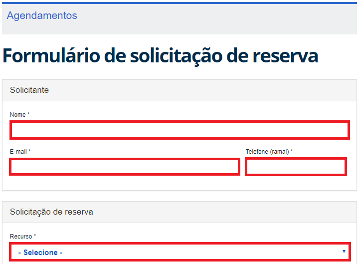

A solicitação será enviada para o e-mail da Secretaria da Unidade Acadêmica e
deverá ser processada pelo(a) secretário(a) encarregado(a) das reservas.

# Instruções para a Secretaria

<video width="320" height="240" controls>
  <source src="../videos/Treinamento Reservas - Secretaria.mp4" type="video/mp4">
  Seu navegador não é compatível.
</video>

Verifique as solicitações no e-mail da Secretaria da Unidade Acadêmica, onde é possível visualizar os dados para que a reserva seja realizada.
Para efetuar a reserva, clique em Menu e depois em Conteúdo no menu de administração superior, conforme a figura abaixo:

Depois, clique em adicionar conteúdo, conforme a figura abaixo:

Escolha o Tipo de conteúdo Reserva, conforme a figura abaixo:

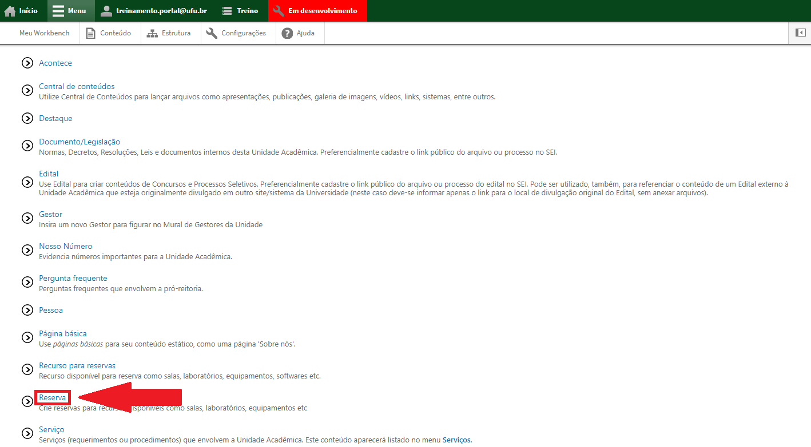

Preencha o campo “Nome da reserva” com o nome da disciplina ou uma curta descrição caso seja uma reserva eventual, conforme a figura abaixo:

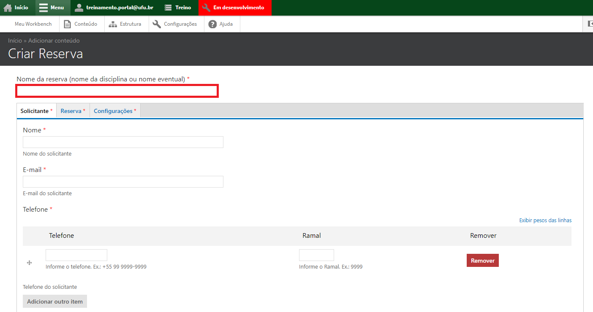

Na aba Solicitante, insira o nome e o e-mail do solicitante da reserva, bem como o Telefone e o Ramal do mesmo, conforme a figura abaixo:

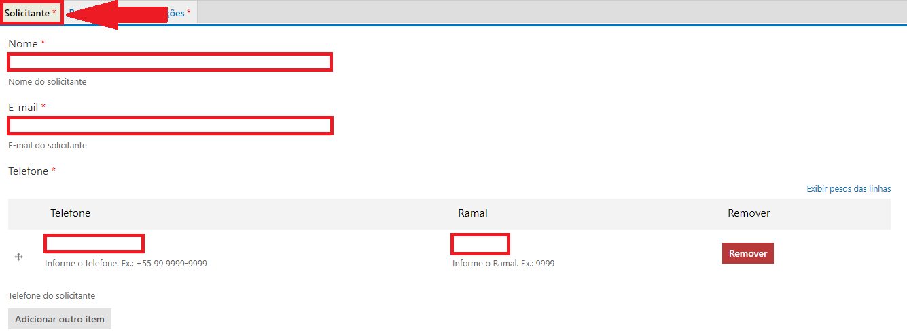

Na aba Reserva, preencha o Campus/Bloco do recurso que está sendo solicitado, o tipo do recurso e a data do agendamento. Se necessário, adicione alguma
observação, conforme a figura abaixo:

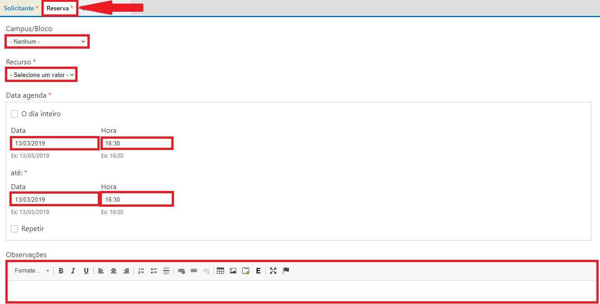

Na aba Configurações, selecione a qual seção pertence o recurso solicitado, conforme a figura abaixo:

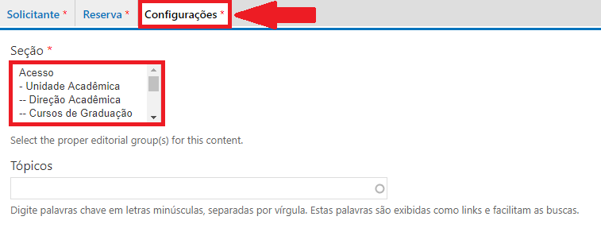

Ao final da página, clique em salvar, conforme a figura abaixo:

