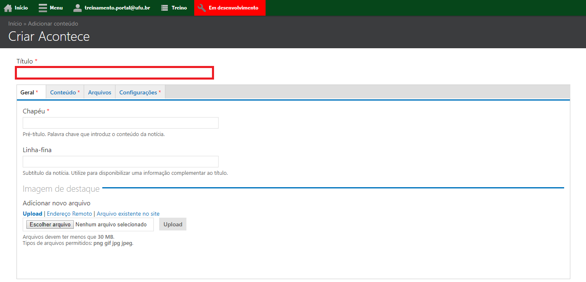
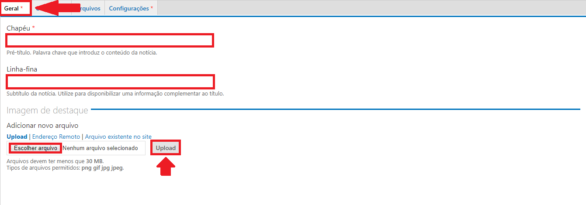
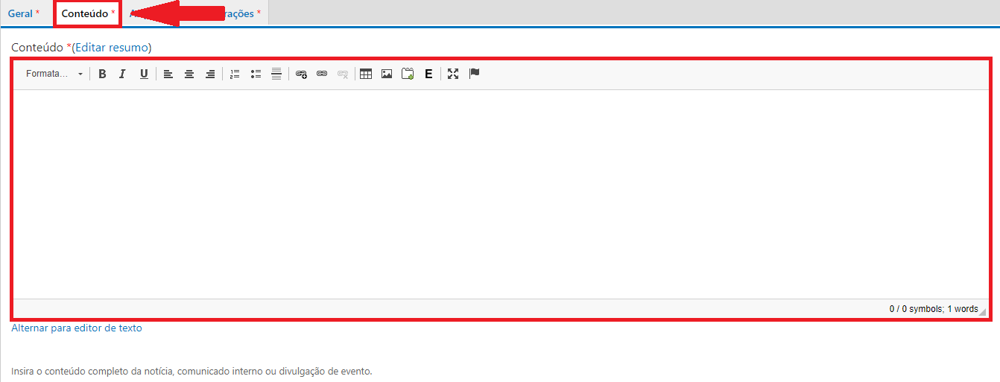
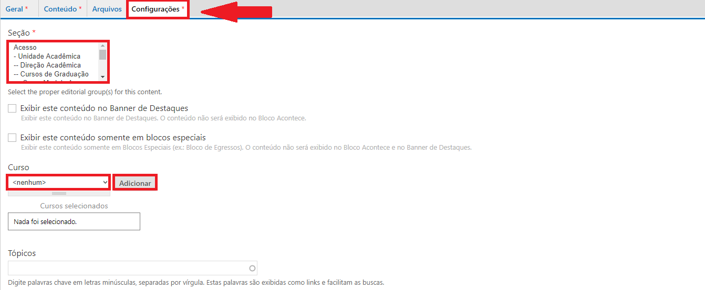
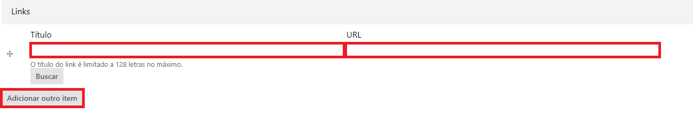
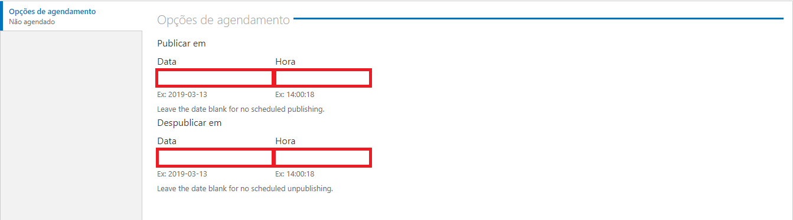

# Adicionar acontece

Acontece é um tipo de conteúdo utilizado para cadastrar notícias e eventos que acontecem na unidade acadêmica. T

Para cadastrar um tipo de conteúdo Editais, vá até o menu superior no website, clique em Menu, depois em Conteúdo, conforme a figura abaixo:

<figure class="image">
  
  
<figcaption>Legenda da figura acima</figcaption>

   
</figure>

Depois clique em Adicionar Conteúdo, conforme a figura abaixo:

Escolha o tipo de conteúdo Acontece, conforme a figura abaixo:

Preencha o título da notícia no campo Título, conforme a figura abaixo:

Preencha o pré-título da notícia no campo Chapéu (O Chapéu é uma introdução ao conteúdo da notícia) e adicione uma imagem relacionada à notícia em Informações do arquivo, conforme a figura abaixo:

Na aba Conteúdo, adicione o conteúdo texto da notícia, conforme a figura abaixo:

Caso necessário, na aba Arquivos, você pode adicionar arquivos de vários formatos à notícia, incluindo arquivos xls, zip, doc, entre outros, conforme a figura abaixo:

Na aba Configurações, selecione a Seção de acordo com o conteúdo da notícia, conforme a figura abaixo:

Ainda na aba Configurações, você pode adicionar Links relacionados a notícia, como por exemplo links de eventos que acontecem na Faculdade ou Instituto, conforme a figura abaixo:

Ao final da página, pode ser feito o agendamento da publicação do conteúdo, preencha caso deseje agendar para um momento posterior ou clique em Salvar para publicar na mesma hora, conforme a figura abaixo:

Ao final da Página clique em Salvar, conforme a figura abaixo:

