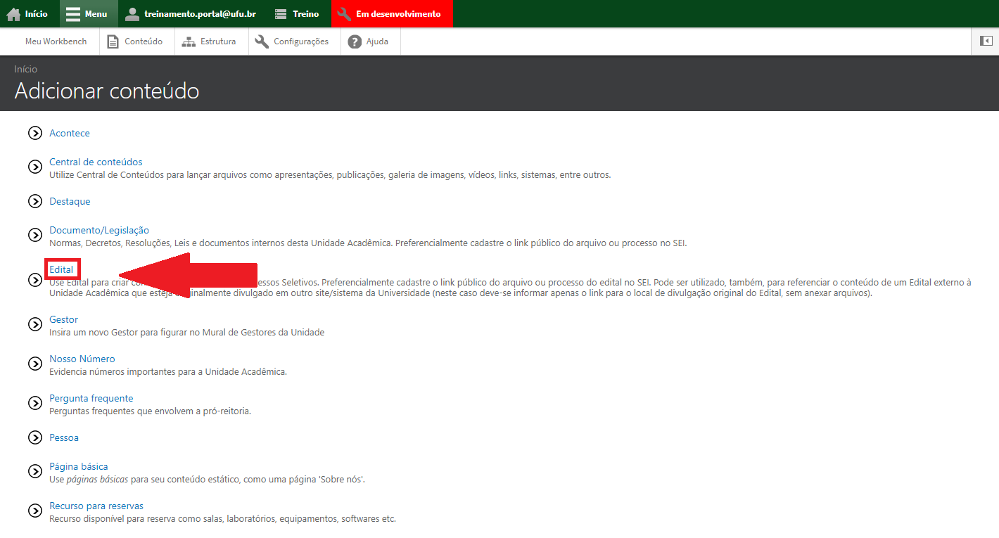
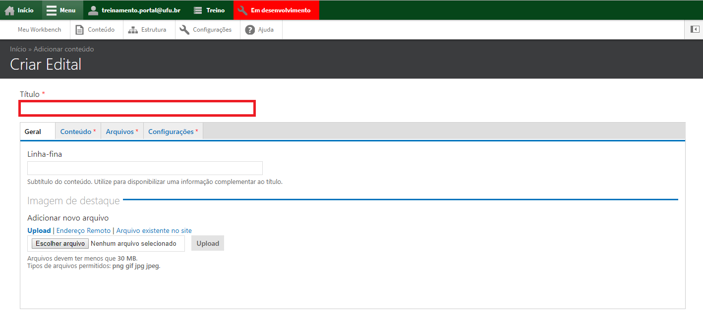
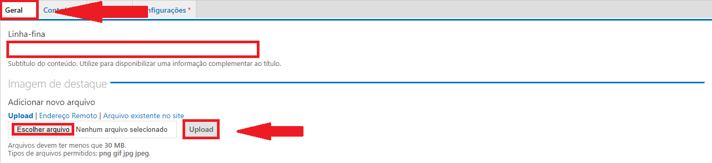
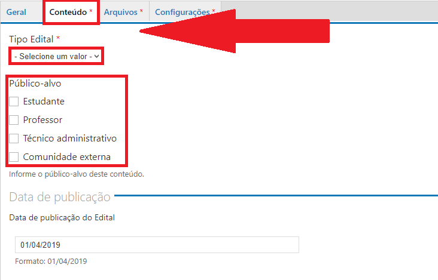
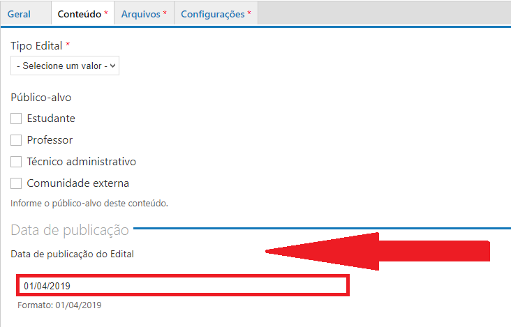
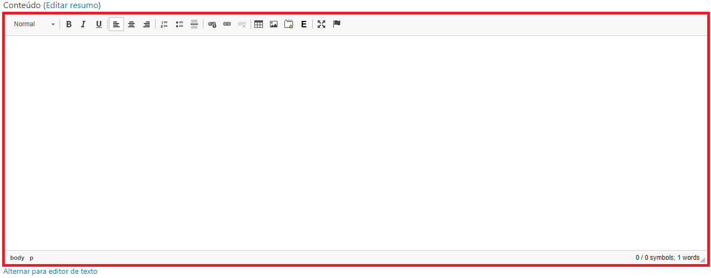
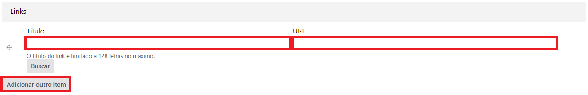
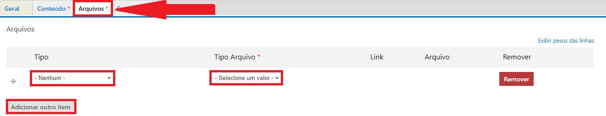
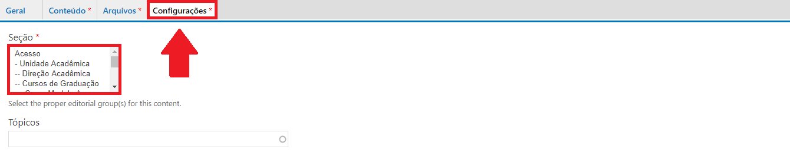
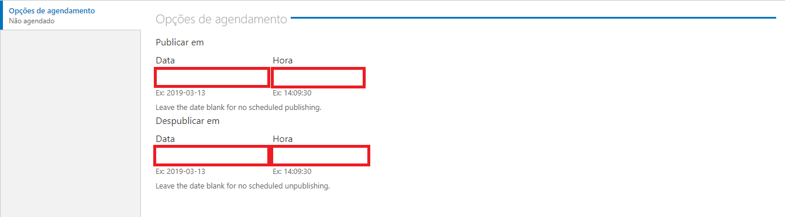

# Adicionar editais

O tipo de conteúdo Editais é um conteúdo utilizado para publicar editais relacionados a unidade acadêmica.

Para cadastrar um tipo de conteúdo Editais, vá até o menu superior no website, clique em Menu, depois em Conteúdo, conforme a figura abaixo:

Depois clique em Adicionar Conteúdo,

Escolha o tipo de conteúdo Editais,

Preencha o título do Edital no campo Título,

Caso necessário, ainda na aba Geral, você pode adicionar uma imagem,

Na aba Conteúdo, adicione os dados do edital e marque o público-alvo (a quem se destina o Edital),

Preencha a data de publicação do Edital,

Caso necessário, preencha o campo Conteúdo com breve informação sobre o Edital,

Para inserir links relacionados com o edital, no campo esquerdo coloque o título do link e no campo direito o link,

Na aba Arquivos, adicione o arquivo do edital (formato pdf, doc ou docx), selecionando o Tipo do Edital e Tipo do Arquivo, podendo ser Link ou Arquivo,

Na aba Configurações, marque a Seção referente ao Edital,

Ao final da página, pode ser feito o agendamento da publicação do conteúdo, preencha caso deseje agendar para um momento posterior,

Ao final da Página clique em Salvar,

