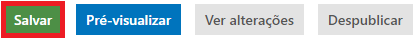
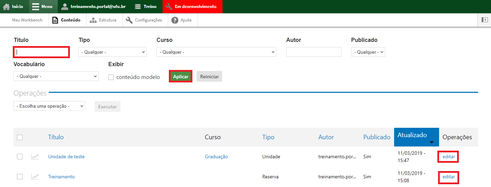
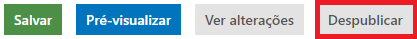

#Editar e Despublicar

Para alterar algum tipo de conteúdo, devemos editá-lo e quando queremos retirar
ele do website, para evitar problemas de exclusão indevida, somente despublicamos o
conteúdo, só podendo ser excluído pela divisão de websites do Centro de Tecnologia
da Informação da UFU.

#Editar

Para editar um tipo de conteúdo qualquer, vá até o menu superior no website, clique em Menu, depois em Conteúdo, conforme a figura abaixo:

No campo Título, digite o nome ou título do conteúdo que será editado e clique em Aplicar. Quando encontrar o conteúdo, clique em editar na coluna Operações,

Realize as devidas alterações e salve no final da página,

#Despublicar

Para despublicar um tipo de conteúdo qualquer, vá até o menu superior no
website, clique em Menu, depois em Conteúdo,

Caso necessário, ainda na aba Geral, você pode adicionar uma imagem,

No final da página de edição, junto ao botão de salvar, clique em Despublicar,

Por vezes, algum dado pode estar incompleto no conteúdo que você irá
despublicar, então, caso dê algum erro e a página não seja despublicada, certifique-se
de que todos os campos com asterisco vermelho (*) foram preenchidos corretamente.