# Editor de texto

O editor de texto está presente em todos os tipos de conteúdo que envolvem um
texto de maior porte. Através do editor, podemos deixar o texto mais intuitivo e
agradável de ser lido e compreendido, destacando partes importantes, centralizando
conteúdos, criando tópicos e muito mais recursos.

A fonte é a grafia com a qual será escrito o conteúdo, por padrão, é utilizada a fonte Arial tamanho 12, conforme a figura abaixo:

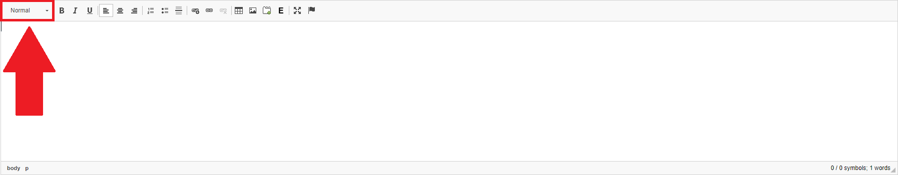

Para propósitos de personalização do texto para melhorar seu entendimento, podemos mudar o tamanho da fonte, colocá-la em negrito, com divisória, dentre outras
opções, conforme a figura abaixo:

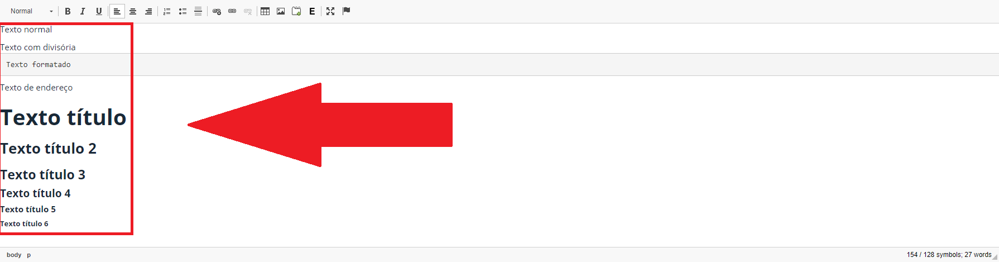

As primeiras opções disponíveis após a seleção da fonte, são as opções de texto em negrito (B), itálico (I) e sublinhado (U), conforme a figura abaixo:

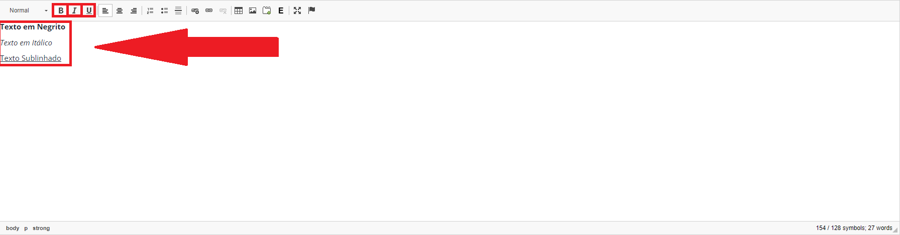

Após a personalização da fonte de escrita, podemos decidir se o texto será alinhado à esquerda, centralizado ou alinhado à direita, dependendo do conteúdo, cada
um terá suas aplicações, conforme a figura abaixo:

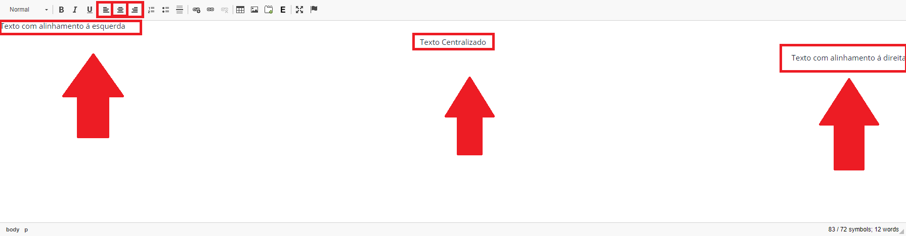

Além disso, podemos inserir tópicos enumerados, tópicos simples e textos com divisória de conteúdo, conforme a figura abaixo:

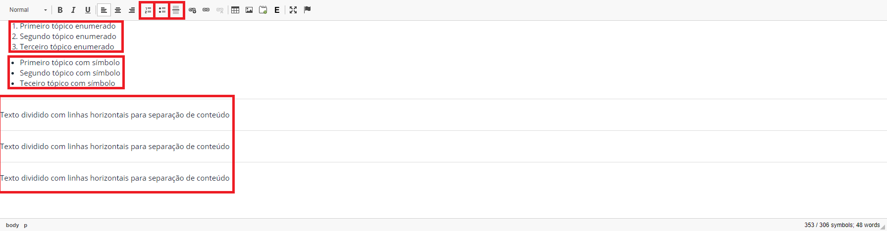

Além das formatações textuais gerais, podemos trabalhos com links, que podem ser associados a alguma página no website da unidade acadêmica ou a um link
externo, conforme a figura abaixo:

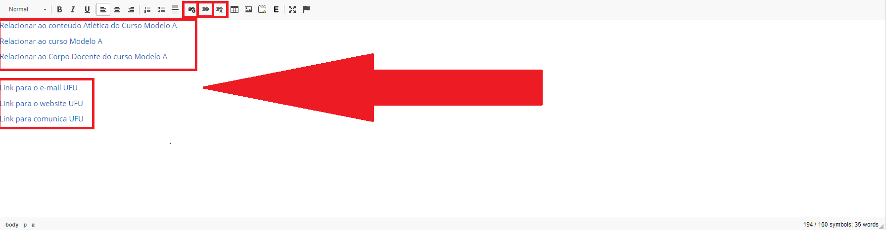

Para inserir um link associado a alguma página do próprio website da unidade acadêmica, podemos clicar no ícone de corrente com +, ao clicar nele, abrirá uma
janela extra, e nela, devemos preencher qual o conteúdo queremos inserir em procurar conteúdo, e em seguida, selecionar o conteúdo encontrado, conforme a figura abaixo:

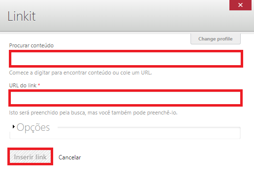

Então, podemos clicar em Opções e escolher o título do link que será inserido, conforme a figura abaixo:

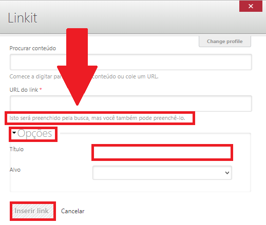

Para inserir links relacionados com o edital, no campo esquerdo coloque o título do link e no campo direito o link, conforme a figura abaixo:

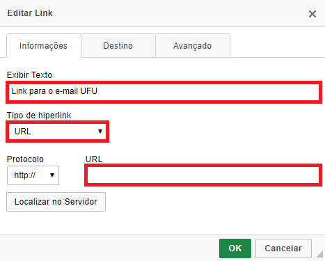

Podemos também inserir links externos, clicando no ícone de corrente e preenchendo o campo Exibir Texto com o título do link e o campo URL com o link e
clicar em OK, conforme a figura abaixo:

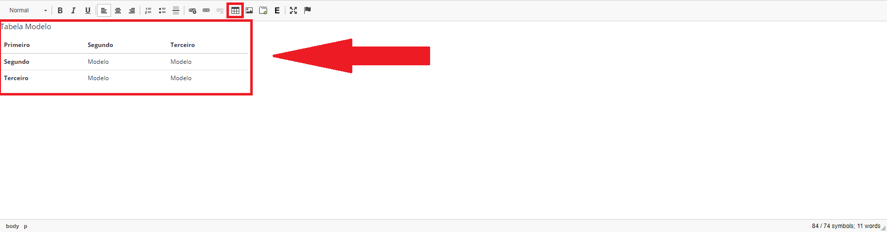

Para organizar melhor o conteúdo a ser exibido, podemos utilizar tabelas.
Podemos criar uma tabela clicando no ícone de tabela, conforme a figura abaixo:

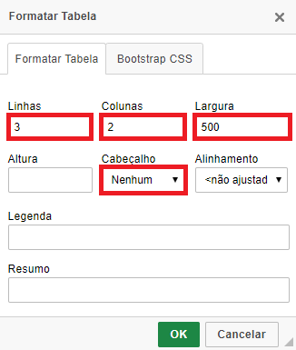

Ao final da Página clique em Salvar, conforme a figura abaixo:

