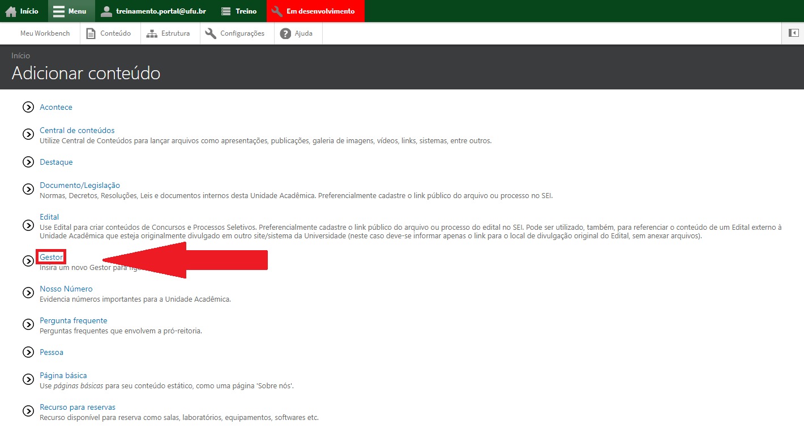
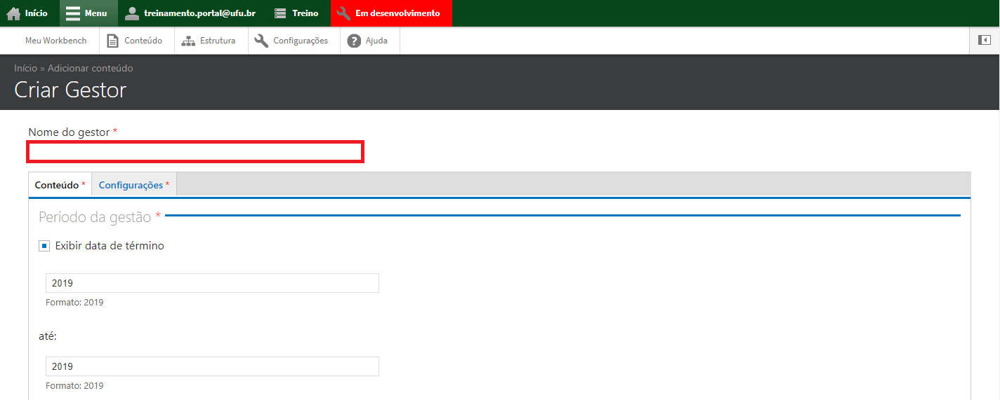
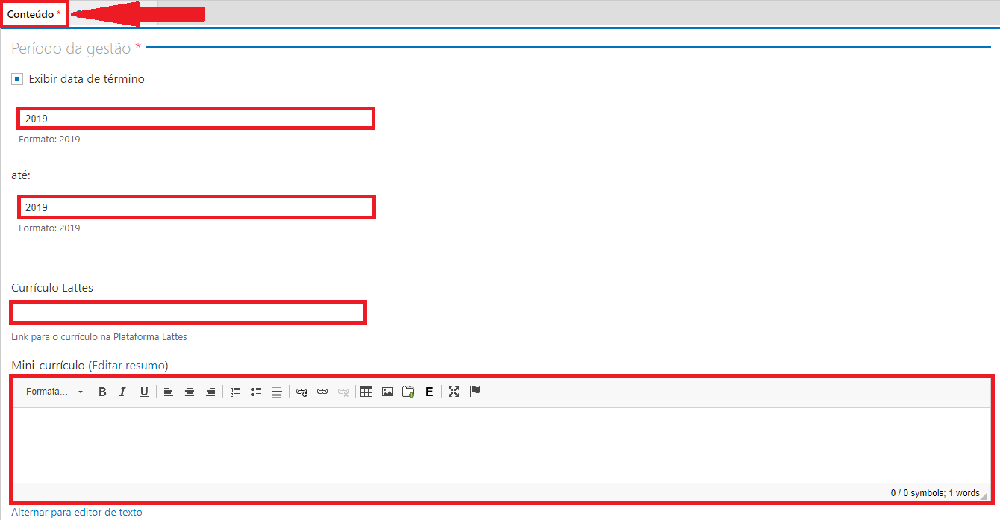
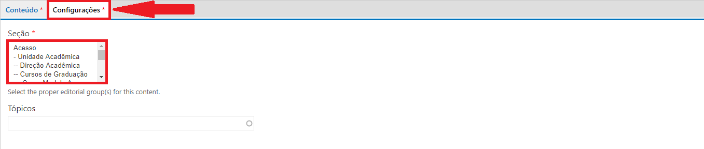

# Adicionar mural de gestores

O Mural de Gestores é uma página básica do website que mantém o registro dos diretores da unidade acadêmica.

Para cadastrar um tipo de conteúdo Mural de Gestores, vá até o menu superior no website, clique em Menu, depois em Conteúdo, conforme a figura abaixo:

Depois clique em Adicionar Conteúdo, conforme a figura abaixo:

Escolha o tipo de conteúdo Mural de Gestores, conforme a figura abaixo:

Preencha o nome do gestor, conforme a figura abaixo:

Na aba Conteúdo, escolha se deverá exibir a data do término da gestão e preencha o ano de início e fim da gestão, além do currículo lattes do gestor e seu mini-
currículo, conforme a figura abaixo:

Na aba Configurações, selecione qual Seção pertence o gestor, conforme a figura abaixo:

Ao final da Página clique em Salvar, conforme a figura abaixo:

