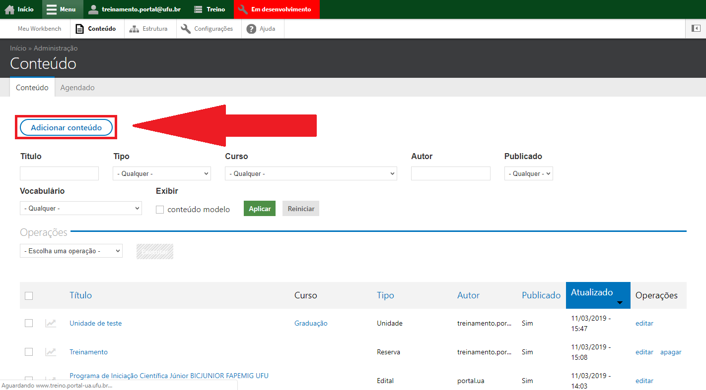

# Adicionar perguntas frequentes

O menu Perguntas Frequentes se trata das perguntas e dúvidas mais comuns em relação à Unidade Acadêmica. Nele, o usuário encontra auxílio para sanar as
principais questões que podem surgir.

Para cadastrar um tipo de conteúdo Perguntas Frequentes, vá até o menu superior no website, clique em Menu, depois em Conteúdo, conforme a  imagem abaixo:

Depois clique em Adicionar Conteúdo, conforme a  imagem abaixo:

Escolha o tipo de conteúdo Perguntas Frequêntes, conforme a  imagem abaixo:

Preencha o título da pergunta no campo Título, conforme a  imagem abaixo:

Na aba Conteúdo, preencha a Resposta da pergunta, conforme a  imagem abaixo:

Caso necessário, adicione arquivos na aba Arquivos, clicando em Escolher arquivo, selecione o arquivo desejado e clique em Upload, conforme a  imagem abaixo:

Na aba Configurações, selecione a Seção a qual pertence a Pergunta e você pode também adicionar links relacionados, inserindo o título do link no campo da
esquerda e o link no campo da direita, conforme a  imagem abaixo:

Ao final da Página clique em Salvar, conforme a  imagem abaixo:

