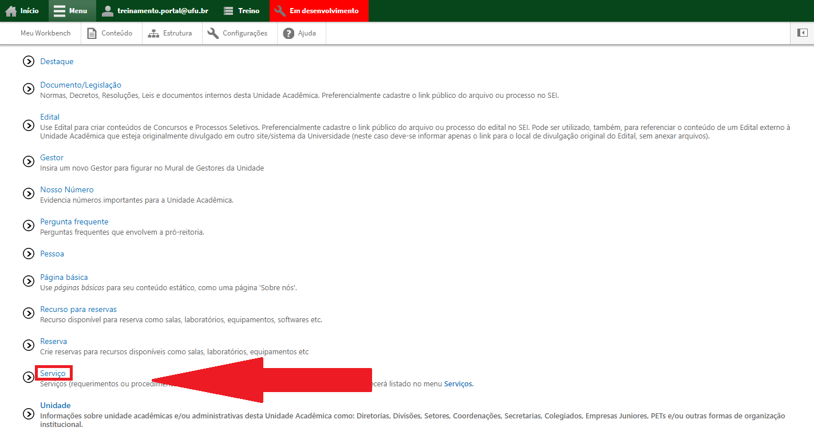
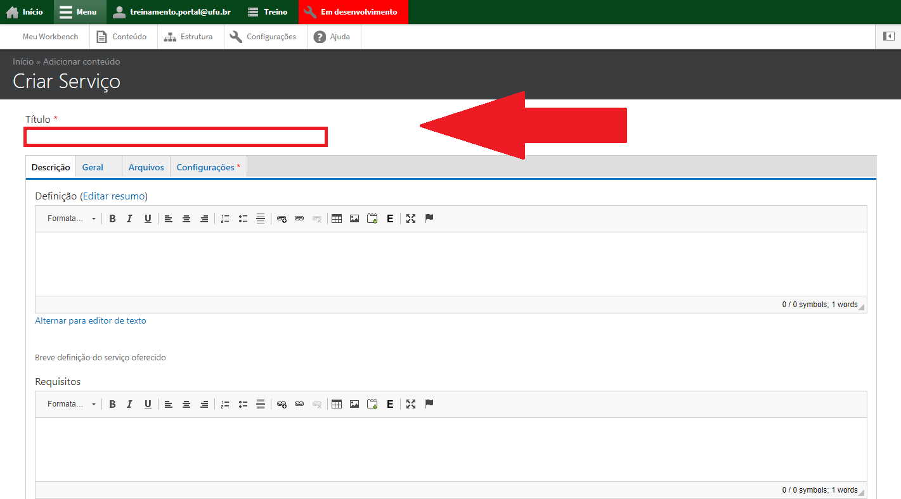
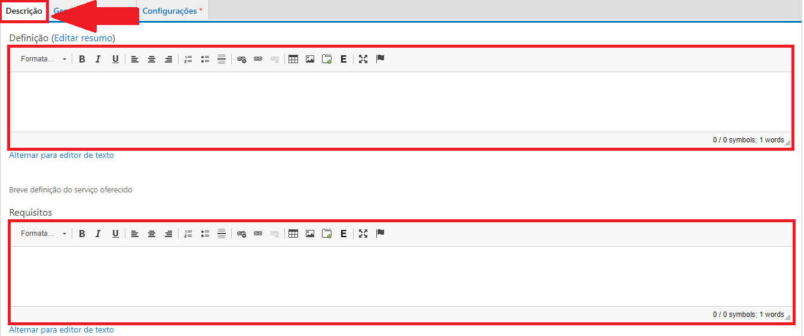
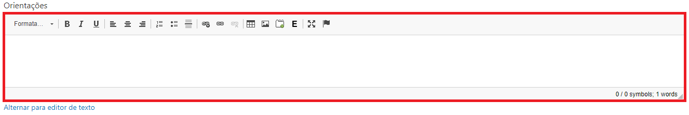
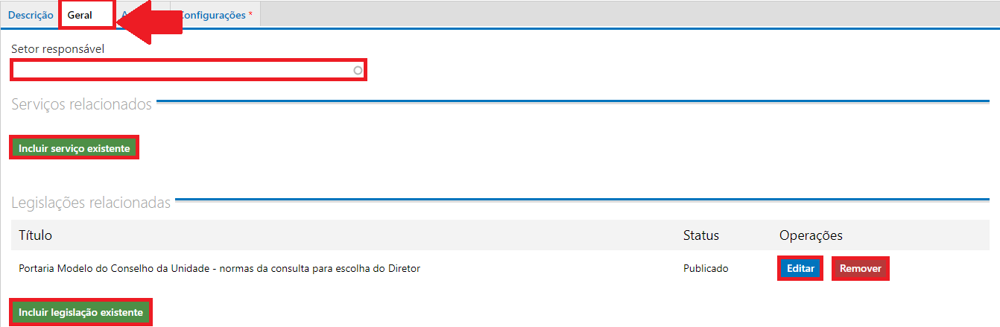
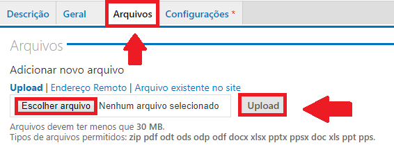
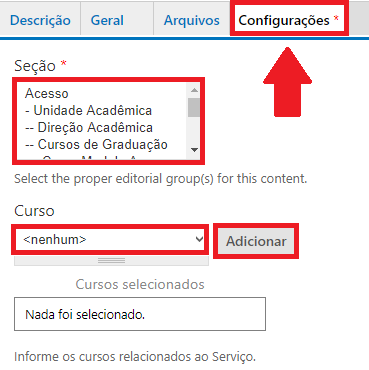
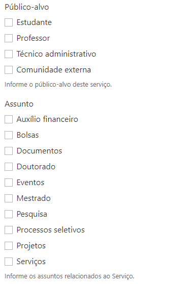
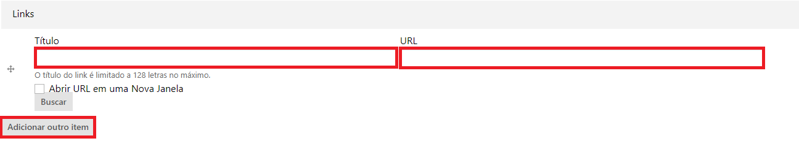
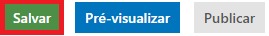

# Adicionar serviço

O tipo de conteúdo Serviço é utilizado para cadastrar serviços fornecidos pela unidade acadêmica. Todo conteúdo criado como serviço irá aparecer listado no menu de serviços.

Para cadastrar uma Serviço, vá até o menu superior no website, clique em Menu depois em Conteúdo, conforme a figura abaixo:

Depois clique em Adicionar Conteúdo, conforme a figura abaixo:

Escolha o tipo de conteúdo Serviços, conforme a figura abaixo:

Preencha o título do Serviço no campo Título, conforme a figura abaixo:

Na aba Descrição, preencha a definição, os requisitos e as orientações para que o usuário possa usufruir do serviço, conforme as figuras abaixo:

Na aba Geral, preencha o setor responsável pelo serviço, geralmente é a Unidade Acadêmica. Também há a possibilidade de incluir, editar ou remover um serviço relacionado clicando em “Incluir serviço existente”, além de poder também,
incluir, editar ou remover uma legislação relacionada ao serviço que está sendo cadastrado, conforme a figura abaixo:

Na aba Arquivos, caso seja necessário, pode-se colocar arquivos relacionados ao serviço. Para isso, clique em escolher arquivo, escolha o arquivo e clique em Upload, conforme a figura abaixo:

Na aba Configurações, escolha primeiramente a qual seção o serviço pertence, depois selecione o tipo do curso, o curso e clique em adicionar, conforme a figura abaixo:

Ainda na aba Configurações, informe qual o público alvo e o assunto do serviço, marcando as caixas relacionadas ao serviço, conforme a figura abaixo:

Por fim, ainda na aba de configurações, podem ser adicionados links com o título e o link que seja relacionado com o serviço que está sendo cadastrado, caso precise de mais de um link, é só clicar em adicionar outro item, conforme a figura abaixo:

Ao final da Página clique em Salvar, conforme a figura abaixo:

